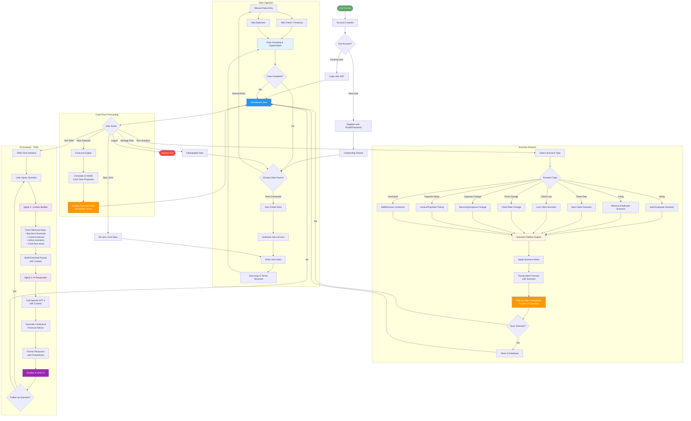

# Tamio Product Architecture

## Overview
Tamio is a cash flow forecasting platform designed for SMEs, combining manual data entry simplicity with powerful AI-driven insights and scenario planning capabilities.

## Technology Stack

### Frontend
- Single Page Application (HTML/JavaScript)
- Chart.js for data visualization
- Responsive design with mobile support

### Backend
- **Framework**: FastAPI (Python)
- **Database**: PostgreSQL with AsyncPG
- **ORM**: SQLAlchemy (Async)
- **Migrations**: Alembic
- **Authentication**: JWT tokens

### External Integrations
- **Xero API**: Accounting data synchronization
- **OpenAI GPT-4**: AI assistant (TAMI)

## Product Flow

## Core Features

### 1. Account Creation & Authentication
- JWT-based authentication
- Secure password hashing (bcrypt)
- Email/password registration
- Persistent sessions

### 2. Data Ingestion
Two primary data entry methods:

#### Manual Entry
- Clients and Revenue streams
- Employees and Payroll
- Recurring Expenses
- Custom billing cycles

#### Xero Integration
- OAuth 2.0 authentication flow
- Automatic data sync
- Smart mapping to Tamio data structure
- Bank account integration
- Invoice and contact synchronization

### 3. Cash Flow Forecasting
- **Time Horizon**: 13-week rolling forecast
- **Methodology**: Event-based projection engine
- **Visualization**: Interactive charts with buffer zones
- **Insights**: Cash runway, low-balance warnings, trend analysis

### 4. Scenario Analysis
12 scenario types supported:
- **People**: Hiring, Firing, Contractor changes
- **Revenue**: Client gain/loss, Rate changes
- **Expenses**: Increased/decreased recurring costs
- **Timing**: Payment delays (inbound/outbound)

**Pipeline Architecture**:
- Dynamic handler system
- Rule-based modifications
- Side-by-side comparisons
- Persistent scenario storage

### 5. TAMI AI Assistant
Two-agent architecture:

#### Agent 1: Context Builder
- Fetches relevant business data
- Analyzes current financial state
- Gathers forecast and scenario information
- Builds enriched prompt with context

#### Agent 2: AI Responder
- OpenAI GPT-4 integration
- Context-aware financial advice
- Natural language responses
- Multi-turn conversation support

## API Endpoints

### Authentication (`/api/v1/auth`)
- POST `/register` - User registration
- POST `/login` - User authentication
- POST `/refresh` - Token refresh

### Data Management (`/api/v1/data`)
- Clients, Employees, Contractors CRUD
- Invoices and Expenses management
- Recurring obligations tracking

### Forecasting (`/api/v1/forecast`)
- GET `/` - Generate forecast
- GET `/summary` - Forecast summary statistics

### Scenarios (`/api/v1/scenarios`)
- GET `/` - List scenarios
- POST `/` - Create scenario
- POST `/pipeline/run` - Execute scenario pipeline
- GET `/{id}/forecast` - Get scenario forecast

### TAMI (`/api/v1/tami`)
- POST `/chat` - Send message to TAMI
- GET `/context` - Get business context

### Xero (`/api/v1/xero`)
- GET `/auth/url` - Get OAuth URL
- POST `/auth/callback` - OAuth callback
- POST `/sync` - Trigger data sync
- GET `/status` - Sync status

## Database Schema

### Core Models
- **User**: Authentication and profile
- **Client**: Revenue sources
- **Employee**: Payroll obligations
- **Contractor**: Variable labor costs
- **Invoice**: Receivables
- **Expense**: Recurring costs
- **Scenario**: What-if analyses
- **XeroConnection**: Integration state

### Relationships
- Users → Multiple clients, employees, scenarios
- Clients → Multiple invoices
- Scenarios → Cloned forecast data

## Security Considerations
- JWT token authentication
- CORS configuration for allowed origins
- Password hashing with bcrypt
- OAuth 2.0 for Xero integration
- Environment-based configuration
- Database connection pooling with pre-ping

## Deployment
- FastAPI ASGI server (Uvicorn)
- PostgreSQL database
- Environment variables for configuration
- Database migrations via Alembic
- Static frontend deployment

## Future Enhancements
- Multi-currency support
- Team collaboration features
- Advanced reporting
- Mobile app
- Additional accounting integrations (QuickBooks, Sage)
- ML-based forecast improvements